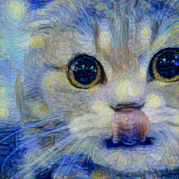

# PyTorch_Neural_Art
Pytorch neural art for fun! :D

This program will allow you to take two images and create a new transformed image.
A style image is an image that will be used to affect a content image. An example would be some sort of art, such as Starry Night.
A content image is an image that will have the style's art applied to it.

The provided run.sh file will take the existing parameters and create some art. The default content image is an image of a cat and the style image is Starry Night. I claim no sort of copyright over the images, I just did a Google search for them.
Example input images can be seen below:

An example output image from these input images can be seen below:

Run the following command for default parameter options:

python3 art.py -h 

The options can allow you to take content and style images from online or locally.

For example, if you wanted to take a local content image and an online style image then run:

python3 art.py --name neural_art --cont_on False --cont_img_loc ./imgs/myImg.jpg --style_img_loc https://upload.wikimedia.org/wikipedia/commons/thumb/e/ea/Van_Gogh_-_Starry_Night_-_Google_Art_Project.jpg/1280px-Van_Gogh_-_Starry_Night_-_Google_Art_Project.jpg

The '--style_weights' can adjust how much style occurs on the image at every iteration. I wanted very stylized images so I have the style weights set to 1000000 for 500 epochs.

Requires:
- NumPy
- PyTorch (torch and torchvision)
- Matplotlib
